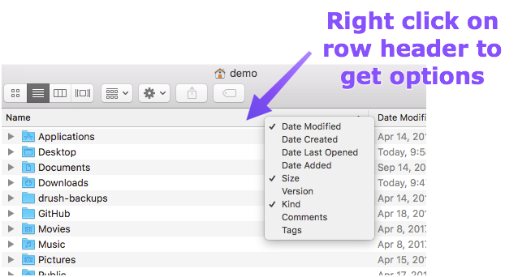

# Setting up a new Mac

### Stuff everyone should know

## Finder preferences

Change Finder-specific preferences via the Finder menu.

- New Finder windows should open to your home directory.
- Change the search scope to start from the current folder. 

**Protip:** In addition to Apple's built-in search functionality, I recommend a shareware app, called [Find Any File](http://apps.tempel.org/FindAnyFile) because it includes invisible files in its results.

## Dock preferences

System-wide preferences can be changed via the Apple menu.

The first thing I usually do on a new Mac is to remove all bundled Applications from the Dock. Hold the **option** key while clicking each Dock icon, then Options..., then "Remove from Dock".

- Position the Dock on the left of the screen to maximize vertical space. 
- Add your favorite applications like Terminal and Activity Viewer to the Dock for easy access, and so you can drag files right onto the Dock icon to open them. 

**Protip:** You can drag the **title bar** of a Finder window to the Terminal icon in the Dock to open that directory on the command line. Similarly, if you are already on the command line, type `open .` to view your current location in the Finder.
 
## Menu bar preferences

I like to show the volume indicator in the menu bar.

A lot of menu bar options are set using System Preferences. For example you can show the current Date & Time in your menu bar.

**Protip:** Press the **option** key when you click on the volume icon in your menu bar to adjust your audio inputs/outputs.  

## Terminal preferences

Many developers swear by iTerm2, but Terminal gets the job done as well.

You can change the default profile, and set a preferred font size, window width, and height. Menlo is included with Macs and it is good monospaced font for the command line. Microsoft Consolas is one of the best command line fonts but [you may have to download it](http://ikato.com/blog/how-to-install-consolas-font-on-mac-os-x.html). 

## Miscellaneous

In the Finder, you can show additional metadata (e.g. Date Created) by right-clicking on the row header.

